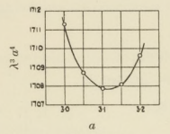

---
jupytext:
  text_representation:
    extension: .md
    format_name: myst
    format_version: 0.13
    jupytext_version: 1.19.0
kernelspec:
  name: python3
  display_name: Python 3 (ipykernel)
  language: python
---

```{code-cell} ipython3
from aliases import *
from referencing import search
```

```{code-cell} ipython3
search('jeffreys')
```

## Criticality

+++

When thermal expansivity rises above a certain threshold, parcels of relatively buoyant material can begin to outpace the conductive timescale and a new, convective geotherm is established. The exact trajectory of this 'critical boundary' through parameter space is not generally known for the model scenarios we are investigating here. Now we shall address this long-standing knowledge gap using the same data-driven methodology we just demonstrated for the conductive (i.e. 'subcritical') endmember.

+++

### A brief history of criticality

+++

The question of criticality is in a sense the father of convection theory, with many of the key developments in the field stemming from inquiries specifically dedicated to the conditions for the onset of convection.

+++

#### Early investigations

+++

Lord Rayleigh himself broached the problem of criticality in his seminal monograph of 1916 [@Rayleigh1916-il]. Inspired by Benard's practical experiments in 1900-1901 (using shallow, basally-heated trays of sperm whale oil), Rayleigh analysed the onset of convection in a plane-layer, basally-heated fluid and established what is now known as the critical *Rayleigh* number for that scenario: $\mathrm{Ra}_\mathrm{cr} = \frac{27\pi}{4} \approx 657.5$. Rayleigh also deduced what we would now call the 'dimensionless wavenumber' $a$ for that scenario: when stated in the terms of Jeffreys [@Jeffreys1926-vv], Rayleigh's calculus puts this value at precisely $a = \pi / \sqrt{2} \approx 2.221$, which translates to a cellular aspect ratio of $2\pi / a = 2\sqrt{2}$ - a classic and canonical result.

Rayleigh's basic insight was that the limiting condition of stability must occur when all the time-dependent components of the evolution function are zero. To force this condition analytically, Rayleigh had to simplify the Navier-Stokes equations dramatically - in particular by assuming free-slip boundaries. A decade later, Harold Jeffreys [@Jeffreys1926-vv] explicitly picked up where Rayleigh left off and established a method based on finite differences to calculate $\mathrm{Ra}_\mathrm{cr}$ for the rigid-bounded case. Due to an arithmetic error, the actual value implied by this method, $\mathrm{Ra}_\mathrm{cr} \approx 1709.5$ (at $a \approx 3.117$), was not correctly reported until 1928 [@Jeffreys1928-ql]. Pellew and Southwell later refined this estimate to $1707.8$ using the superior 'exchange of stabilities' method [@Pellew1940-qf], which Jeffreys had been sceptical of [@Jeffreys1928-ql]; they also went further by considering the mixed case of one free and one rigid wall, obtaining $\mathrm{Ra}_\mathrm{cr} \approx 1100.7$.

Key to the analysis by Pellew and Southwell was the identification of a plane of symmetry through the equations which they dubbed the 'characteristic number' of convection. This is what we know as the *Rayleigh* number today - a nomenclature introduced in the English-language literature apparently by Sutton [@Sutton1950-yb], who also presented it in its familiar modern form:

$$
\mathrm{Ra} = -\frac{\beta g\alpha h^4}{\kappa\nu}
$$

Sutton was a critic of Rayleigh's method and pointed out that the experimental apparatus of the time could not possibly emulate the conditions that underpinned his analysis (for example, the existence prior to convection of a conductive geotherm). In this sense, Sutton was an early advocate of the data-driven approach we are embarked upon here, except that the data available in that era was necessarily too contingent on laboratory paraphernalia to actually capture the deeper principles that Rayleigh, Jeffreys, and the others had uncovered.

Remarkably, all these early authors considered the full three-dimensional case, rather than the considerably simpler two-dimensional case - perhaps because it is paradoxically easier to model in a laboratory with physical apparatus (a practical two-dimensional model would require extremely slippery materials for the suppressed $z$ walls. Also interesting to note in this time is the first reference to a connection between the criticality problem and the Earth's deep processes, which is to be found in Jeffreys [@Jeffreys1926-vv].

+++



+++

#### Post-war investigations

+++

After the war, new mathematical techniques and the advent of the computer inaugurated the modern era of convection studies. As before, the behaviour of fluids around the critical point was a core concern.

Chandrasekhar synthesised virtually everything that was then known about convection in his monumental 'Hydrodynamic and Hydromagnetic stability' [@Chandrasekhar1961-ez]. This substantial tome, which is often the bedrock citation in modern papers on the topic, tabulated the critical *Rayleigh* numbers ($\mathrm{Ra}_c$) and wavenumbers ($a_c$) for the three combinations of kinematic boundary conditions, with greater precision than had previously been possible:

| Scenario   | Critical *Rayleigh* number | Critical wavenumber |
| :- | :- | :- |
| Both rigid | $1707.762$ | $3.117$ |
| One rigid, one free | $1100.65$ | $2.682$ |
| Both free | $657.511$ | $2.221$ |

Chandrasekhar reproduced these quantities by formulating the problem in terms of eigenvectors and eigenvalues (rather than using the 'proper' or 'characteristic' numbers of earlier authors) and solving for them using a then-novel method: the Galerkin method. His approach is the direct ancestor of the finite element method we will shortly employ for our own numerical experiments. Chandrasekhar also contributed an important observation regarding the question of whether there is a 'correct' or 'ideal' planform for convectinve onset: while earlier authors had been preoccupied with the different shapes these cells could take, Chandrasekhar demonstrated that only the **size** of the cells matters; the shape is in fact degenerate (i.e. unconstrained). The implications of this easily-overlooked fact are profound.

The 1960s saw a wave of investigations that pushed beyond the assumptions of the previous half-century. Sparrow, Goldstein, and Jonsson [@Sparrow1964-rv] extended the standard analysis from solely Dirichlet-type (i.e. fixed-value) boundaries to include Neumann-type (i.e. fixed-flux) boundaries, and - crucially for geodynamics applications - began to consider internal heat sources for the fluid as well. For both, they found that the effect was to lower the critical Rayleigh number - i.e. to destabilise the fluid.

| Upper kinematic condition (lower rigid) | Lower thermal condition | Upper thermal condition | Critical *Rayleigh* number | Critical wavenumber |
| :- | :- | :- | :- | :- |
| Rigid | Dirichlet | Dirichlet | $1707.765$ | $3.12$ |
| Rigid | Dirichlet | Neumann | $1295.781$ | $2.55$ |
| Rigid | Neumann | Dirichlet | $1295.781$ | $2.55$ |
| Rigid | Neumann | Neumann | $720.0$ | $0$ |
| Free | Dirichlet | Dirichlet | $1100.657$ | $2.68$ |
| Free | Dirichlet | Neumann | $669.001$ | $2.09$ |
| Free | Neumann | Dirichlet | $816.748$ | $2.21$ |
| Free | Neumann | Neumann | $320.0$ | $0$ |

| Internal heat production (both rigid, both fixed) | Critical *Rayleigh* number | Critical wavenumber |
| :- | :- | :- |
| $0$ | $1707.765$ | $3.12$ |
| $0.5$ | $1704.453$ | $3.12$ |
| $1.0$ | $1694.953$ | $3.13$ |
| $2.5$ | $1632.886$ | $3.18$ |
| $10$ | $1118.430$ | $3.53$ |

*Benchmark results from Sparrow [@Sparrow1964-rv]. In all cases considered, the lower boundary was rigid. For the internal heating scenarios, both walls were held rigid and fixed in temperature.*

The analysis of Sparrow *et al* covers what we would now call the 'mixed-heating' scenario; for the purely internally-heated scenario (i.e. with an insulated lower boundary), we can turn to Roberts [Roberts1967-aq] who found that, for all heat production rates, $\mathrm{Ra}_\mathrm{cr} \approx 2772.28$ and $a_c \approx 2.629$. Roberts also identified that this scenario produces a strong vertical asymmetry, which is not observed in other (planar) cases

Another early assumption challenged in this period was the assumption of infinite lateral extent. Davis [@Davis1967-vs] identified that in such a scenario the wavenumber (the spatial frequency of convection cells) could no longer be allowed to vary freely, but would necessarily be constrained to the spatial harmonics of the chamber's dimensions. Using the Galerkin method, Davis showed that the lateral constraints on the domain were in fact of first-order significance in determining the shape, and therefore the efficiency, of the cells, and consequently the overall stability of the fluid.

One of the principle themes of this era was the increasing use of computers to speed calculation, and correspondingly, an increased appetite for iterative and trial-based methods. The uptake of these methods was not even. Sparrow and colleagues cited a 48-bit computer in their study of 1964 [@Sparrow1964-rv], while Davis a few years later cited his friend Margaret [@Davis1967-vs].

The advent of computing did not diminish the need for or interest in practical experimentation, which also proceeded apace in this era thanks to new methods and materials. Kulacki and Goldstein [@Kulacki1972-xm] used electrolytic fluids under oscillating currents to induce an internal heating force, then characterised the resultant flow pattern with the aid of an interferometer - an experimental setup that was not conceivable in Benard and Rayleigh's time. Their meticulously quantified findings verified the analytical results of previous authors like Sparrow and Roberts, converging on identical values for the critical Rayleigh number and other key quantities. Kulacki and Goldstein also validated the larger intuition behind $\mathrm{Ra}_\mathrm{cr}$ by physically agitating a near-critical fluid with a glass rod: they observed that, even with strong manual perturbation, it was impossible to establish convection by such means. This had long been suspected but does not appear to have actually been rigorously tested before this time.

With the growing acceptance of plate tectonics from the 1960s onwards, and the identification of mantle convection as a plausible causal mechanism, the relevance of convective onset theory to geophysics 

```{code-cell} ipython3
2 * math.sqrt(2)
```

```{code-cell} ipython3
2 * math.pi / 2.221
```

## NOTES

```{code-cell} ipython3
import math
math.sqrt(math.pi**2 / 2)
```

[@Rayleigh1916-il]

- 

+++

Rayleigh1916-il
{LIX}. On convection currents in a horizontal layer of fluid,
when the higher temperature is on the under side
Rayleigh, Lord

Jeffreys1926-vv
{LXXVI}. \textit{The stability of a layer of fluid heated below}
Jeffreys, Harold

Jeffreys1928-ql
Some cases of instability in fluid motion
Jeffreys, Harold

Pellew1940-qf
On maintained convective motion in a fluid heated from below
Pellew, Anne and Southwell, Richard Vynne

Sutton1950-yb
On the stability of a fluid heated from below
Sutton, Oliver Graham

Malkus1954-ii
The heat transport and spectrum of thermal turbulence
Malkus, W V R

Chandrasekhar1961-ez
Hydrodynamic and hydromagnetic stability
Chandrasekhar, Subrahmanyan

Sparrow1964-rv
Thermal instability in a horizontal fluid layer: effect of
boundary conditions and non-linear temperature profile
Sparrow, E M and Goldstein, R J and Jonsson, V K

Davis1967-vs
Convection in a box: linear theory
Davis, Stephen H


Roberts1967-aq
Convection in horizontal layers with internal heat generation.
Theory
Roberts, P H


Nield1968-dh
Onset of thermohaline convection in a porous medium
Nield, D A

Kulacki1972-xm
Thermal convection in a horizontal fluid layer with uniform
volumetric energy sources
Kulacki, F A and Goldstein, R J

Stengel1982-fw
Onset of convection in a variable-viscosity fluid
Stengel, Karl C and Oliver, Dean S and Booker, John R

Alonso1999-zr
Onset of convection in a rotating annulus with radial gravity and
heating
Alonso, A and Net, M and Mercader, I and Knobloch, E

Solomatov1995-is
Scaling of temperature‐ and stress‐dependent viscosity convection
Solomatov, V S

Solomatov2000-xn
Scaling of time-dependent stagnant lid convection: Application to
small-scale convection on Earth and other terrestrial planets
Solomatov, V S and Moresi, L-N

+++

Hopkins1839-dw
{XX}. Researches in physical geology
Hopkins, William

Fisher1881-au
Physics of the earth's crust
Fisher, Osmond
