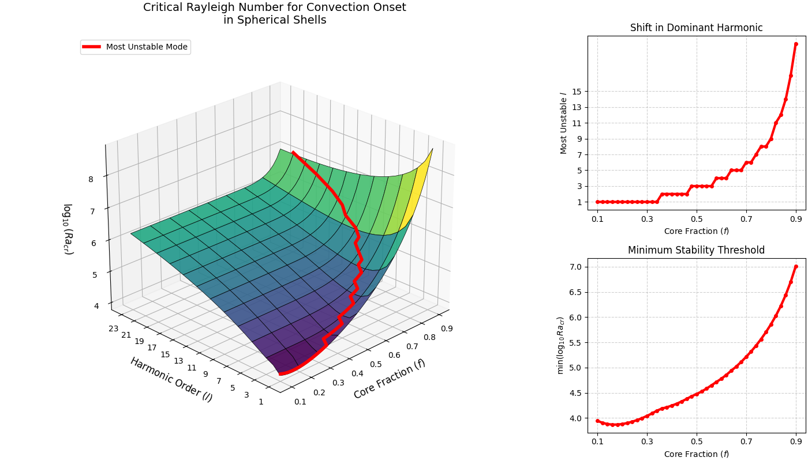
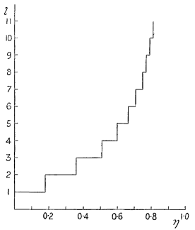

---
jupytext:
  text_representation:
    extension: .md
    format_name: myst
    format_version: 0.13
    jupytext_version: 1.19.0
kernelspec:
  name: python3
  display_name: Python 3 (ipykernel)
  language: python
---

## Criticality

+++

When thermal expansivity rises above a certain threshold, parcels of relatively buoyant material can begin to outpace the conductive timescale and a new, convective geotherm is established. The exact trajectory of this 'critical boundary' through parameter space is not generally known for the model scenarios we are investigating here. Now we shall address this long-standing knowledge gap using the same data-driven methodology we just demonstrated for the conductive (i.e. 'subcritical') endmember.

+++

### A brief history of criticality

+++

The question of criticality is in a sense the father of convection theory, with many of the key developments in the field stemming from inquiries specifically dedicated to the conditions for the onset of convection.

+++

#### Early investigations

+++

Lord Rayleigh himself broached the problem of criticality in his seminal monograph of 1916 [@Rayleigh1916-il]. Inspired by Benard's practical experiments in 1900-1901 (using shallow, basally-heated trays of sperm whale oil), Rayleigh analysed the onset of convection in a plane-layer, basally-heated fluid and established what is now known as the critical *Rayleigh* number for that scenario: $\mathrm{Ra}_\mathrm{cr} = \frac{27\pi^4}{4} \approx 657.5$. Rayleigh also deduced what we would now call the 'dimensionless wavenumber' $a$ for that scenario: when stated in the terms of Jeffreys [@Jeffreys1926-vv], Rayleigh's calculus puts this value at precisely $a = \pi / \sqrt{2} \approx 2.221$, which translates to a cellular aspect ratio of $2\pi / a = 2\sqrt{2}$ - a classic and canonical result.

Rayleigh's basic insight was that the limiting condition of stability must occur when all the time-dependent components of the evolution function are zero. To force this condition analytically, Rayleigh had to simplify the Navier-Stokes equations dramatically - in particular by assuming free-slip boundaries. A decade later, Harold Jeffreys explicitly picked up where Rayleigh left off and established a method based on finite differences to calculate the critical threshold for the rigid-bounded case - first crudely [@Jeffreys1926-vv], then more precisely [@Jeffreys1928-ql] - obtaining $\mathrm{Ra}_\mathrm{cr} \approx 1709.5$ at $a \approx 3.117$. Pellew and Southwell later refined this estimate to $1707.8$ using the superior 'exchange of stabilities' method [@Pellew1940-qf], which Jeffreys had been sceptical of [@Jeffreys1928-ql]; they also went further by considering the mixed case of one free and one rigid wall, obtaining $\mathrm{Ra}_\mathrm{cr} \approx 1100.7$.

Key to the analysis by Pellew and Southwell was the identification of a plane of symmetry through the equations which they dubbed the 'characteristic number' of convection. This is what we know as the *Rayleigh* number today - a nomenclature introduced in the English-language literature apparently by Sutton [@Sutton1950-yb], who also presented it in its familiar modern form:

$$
\mathrm{Ra} = -\frac{\beta g\alpha h^4}{\kappa\nu}
$$

Sutton was a critic of Rayleigh's method and pointed out that the experimental apparatus of the time could not possibly emulate the conditions that underpinned his analysis (for example, the existence prior to convection of a conductive geotherm). In this sense, Sutton was an early advocate of the data-driven approach we are embarked upon here, except that the data available in that era was necessarily too contingent on laboratory paraphernalia to actually capture the deeper principles that Rayleigh, Jeffreys, and the others had uncovered.

Remarkably, all these early authors considered the full three-dimensional case, rather than the considerably simpler two-dimensional case - perhaps because it is paradoxically easier to model in a laboratory with physical apparatus (a practical two-dimensional model would require extremely slippery materials for the suppressed $z$ walls. Also interesting to note in this time is the first reference to a connection between the criticality problem and the Earth's deep processes, which is to be found in Jeffreys [@Jeffreys1926-vv].

+++


*Figure from Pellew and Southwell showing the critical stability (related to $\mathrm{Ra}_\mathrm{cr}$ against the wavenumber $a$ (effectively the number of peaks, or equivalently troughs, in the planform).*

+++

#### Post-war investigations

+++

After the war, new mathematical techniques and the advent of the computer inaugurated the modern era of convection studies. As before, the behaviour of fluids around the critical point was a core concern.

Chandrasekhar synthesised virtually everything that was then known about convection in his monumental 'Hydrodynamic and Hydromagnetic stability' [@Chandrasekhar1961-ez]. This substantial tome, which is often the bedrock citation in modern papers on the topic, tabulated the critical *Rayleigh* numbers ($\mathrm{Ra}_\mathrm{cr}$) and wavenumbers ($a_\mathrm{cr}$) for the three combinations of kinematic boundary conditions, with greater precision than had previously been possible:

| Scenario   | Critical *Rayleigh* number | Critical wavenumber |
| :- | :- | :- |
| Both rigid | $1707.762$ | $3.117$ |
| One rigid, one free | $1100.65$ | $2.682$ |
| Both free | $657.511$ | $2.221$ |

Chandrasekhar reproduced these quantities by formulating the problem in terms of eigenvectors and eigenvalues (rather than using the 'proper' or 'characteristic' numbers of earlier authors) and solving for them using a then-novel method: the Galerkin method. His approach is the direct ancestor of the finite element method we will shortly employ for our own numerical experiments. Chandrasekhar also contributed an important observation regarding the question of whether there is a 'correct' or 'ideal' planform for convectinve onset: while earlier authors had been preoccupied with the different shapes these cells could take, Chandrasekhar demonstrated that only the **size** of the cells matters; the shape is in fact degenerate (i.e. unconstrained). The implications of this easily-overlooked fact are profound.

The 1960s saw a wave of investigations that pushed beyond the assumptions of the previous half-century. Sparrow, Goldstein, and Jonsson [@Sparrow1964-rv] extended the standard analysis from solely Dirichlet-type (i.e. fixed-value) boundaries to include Neumann-type (i.e. fixed-flux) boundaries, and - crucially for geodynamics applications - began to consider internal heat sources for the fluid as well. For both, they found that the effect was to lower the critical Rayleigh number - i.e. to destabilise the fluid.

| Upper kinematic condition (lower rigid) | Lower thermal condition | Upper thermal condition | Critical *Rayleigh* number | Critical wavenumber |
| :- | :- | :- | :- | :- |
| Rigid | Dirichlet | Dirichlet | $1707.765$ | $3.12$ |
| Rigid | Dirichlet | Neumann | $1295.781$ | $2.55$ |
| Rigid | Neumann | Dirichlet | $1295.781$ | $2.55$ |
| Rigid | Neumann | Neumann | $720.0$ | $0$ |
| Free | Dirichlet | Dirichlet | $1100.657$ | $2.68$ |
| Free | Dirichlet | Neumann | $669.001$ | $2.09$ |
| Free | Neumann | Dirichlet | $816.748$ | $2.21$ |
| Free | Neumann | Neumann | $320.0$ | $0$ |

| Internal heat production (both rigid, both fixed) | Critical *Rayleigh* number | Critical wavenumber |
| :- | :- | :- |
| $0$ | $1707.765$ | $3.12$ |
| $0.5$ | $1704.453$ | $3.12$ |
| $1.0$ | $1694.953$ | $3.13$ |
| $2.5$ | $1632.886$ | $3.18$ |
| $10$ | $1118.430$ | $3.53$ |

*Benchmark results from Sparrow [@Sparrow1964-rv]. In all cases considered, the lower boundary was rigid. For the internal heating scenarios, both walls were held rigid and fixed in temperature.*

The analysis of Sparrow *et al* covers what we would now call the 'mixed-heating' scenario; for the purely internally-heated scenario (i.e. with an insulated lower boundary), we can turn to Roberts [@Roberts1967-aq] who found that, for all heat production rates, $\mathrm{Ra}_\mathrm{cr} \approx 2772.28$ and $a_c \approx 2.629$. Roberts also identified that this scenario produces a strong vertical asymmetry, which is not observed in other (planar) cases.

Another early assumption challenged in this period was the assumption of infinite lateral extent. Davis [@Davis1967-vs] identified that in such a scenario the wavenumber (the spatial frequency of convection cells) could no longer be allowed to vary freely, but would necessarily be constrained to the spatial harmonics of the chamber's dimensions. Using the Galerkin method, Davis showed that the lateral constraints on the domain were in fact of first-order significance in determining the shape, and therefore the efficiency, of the cells, and consequently the overall stability of the fluid.

One of the principle themes of this era was the increasing use of computers to speed calculation, and correspondingly, an increased appetite for iterative and trial-based methods. The uptake of these methods was not even. Sparrow and colleagues cited a 48-bit computer in their study of 1964 [@Sparrow1964-rv], while Davis a few years later cited his friend Margaret [@Davis1967-vs].

The advent of computing did not diminish the need for or interest in practical experimentation, which also proceeded apace in this era thanks to new methods and materials. Kulacki and Goldstein [@Kulacki1972-xm] used electrolytic fluids under oscillating currents to induce an internal heating force, then characterised the resultant flow pattern with the aid of an interferometer - an experimental setup that was not conceivable in Benard and Rayleigh's time. Their meticulously quantified findings verified the analytical results of previous authors like Sparrow and Roberts, converging on identical values for the critical Rayleigh number and other key quantities. Kulacki and Goldstein also validated the larger intuition behind $\mathrm{Ra}_\mathrm{cr}$ by physically agitating a near-critical fluid with a glass rod: they observed that, even with strong manual perturbation, it was impossible to establish convection by such means. This had long been suspected but does not appear to have actually been rigorously tested before this time.

+++

#### Geophysics investigations

+++

With the growing acceptance of plate tectonics from the 1960s onwards, and the identification of mantle convection as a plausible causal mechanism, the relevance of convective onset theory to geophysics finally became apparent, and a new wave of investigations into high- and variable-viscosity fluids began.

To argue that the mantle is convecting is to argue that it lies above (and post) the critical threshold for the onset of convection. In 1966, McKenzie [@McKenzie1966-dy] used Haskell's isostasy numbers [@Haskell1935-mk] to calculate the effective viscosity of the lower mantle; three years later, Schubert, Turcotte, and Oxburgh [@Schubert1969-dn] applied linear stability analysis to those numbers and found that the mantles of Earth and other planets must lie well above the critical *Rayleigh* number and must surely be convecting rapidly.

The Schubert model presumed depth-dependent viscosity in lieu of temperature-dependent viscosity, which was analytically much more complex. The question of temperature-dependent viscosity had previously been broached by Enok Palm in 1960 [@Palm1960-cc]. Palm was trying to elucidate the longstanding mystery (first recognised by Lord Rayleigh [@Rayleigh1916-il]) of why nascent convective cells at the point of onset predictably develop into certain shapes even when there is no comparative advantage for heat transport. While Chandrasekhar [@Chandrasekhar1961-ez] would soon demonstrate that the planform in most cases is mathematically degenerate, Palm instead developed upon earlier speculation that the cells were nudged into their customary shapes by differences in fluid properties - specifically, different viscosity responses to changes in temperature. Palm's use of a simplified temperature dependency function led him to conclude that variable viscosity is destabilising (i.e. reduces $\mathrm{Ra}_\mathrm{cr}$) on the whole, explaining its potential role in tipping the scales between different planforms.

Palm's method was resourceful but unrealistic, with Segel and Stuart [@Segel1962-xx] later showing that variable viscosity could only explain planform differences at extreme values, and that in most cases the planform that was actually established after convective onset was determined as much by initial conditions as by fluid properties. All authors in that era nevertheless agreed that temperature-dependent viscosity tends to prefer (3D) hexagonal cells in which fluid upwells in narrow channels while downwelling on broad fronts - an important finding that anticipated the intuitions of modern geodynamics.

The effect of variable viscosity on the onset of convection was not substantially approached again until geophysicists Stengel, Oliver, and Booker picked up the thread in 1982 [@Stengel1982-fw]. By analysis, they quickly determined that Palm's earlier results were an artifact of his simplified viscosity law and that, with a more realistic exponential temperature law and above a certain threshold viscosity ratio (about $3,000$), the effect was the *inverse* of that previously documented: highly temperature-dependent viscosity *suppresses* convection rather than enhances it. Numerically and experimentally, Stengel and colleagues observed the development of a so-called 'stagnant lid' in the fluid that effectively 'squashed' convection both thermally and spatially, and reasoned that convection must always begin in the sublayer with the maximum (local) *Rayleigh* number, thereby conditioning global $\mathrm{Ra}_\mathrm{cr}$.

Geophysical investigations of convection, then and subsequently, have been hampered by the difficulties of generating sufficiently large viscosity contrasts and *Rayleigh* numbers. Insofar as the bulk Earth is a convecting thermal fluid, it is an extremely high-$\mathrm{Ra}$ one with colossal viscosity jumps. Approaching this domain in the laboratory posed mounting difficulties, with Richter [@Richter1983-pf] and White [@White1988-hy] succeeding in initiating convection around the thresholds identified by Stengel *et al.*, albeit with substantial distortions and fluctuations induced by the practicalities of the apparatus.

In 1995, Solomatov [@Solomatov1995-is] addressed the same topic by purely computational means. His model validated the $\approx 3,000$ viscosity ratio boundary between mobile and stagnant lid convection and also suggested an expression for the thickness of the convecting sublayer. If the viscosity law is given as $\eta = \eta_0 / e^{\gamma T}$:

$$
z_{\mathrm{sub}} = \frac{8\delta_0}{p}
$$

Where $\delta_0$ is the thickness of the cold thermal boundary layer and $p$ is $\gamma \Delta T$ (often scaled to unit in dimensionless treatments). Solomatov's analysis showed that the classic heat transport to convective vigour relation $\mathrm{Nu}\sim\mathrm{Ra}^{1/3}$ could be preserved if the *Rayleigh* number was precisely adjusted to recognise the sublayer behaviour, thus reuniting the geophysically relevant domain of stagnant-lid convection with the deeper heritage of convection theory.

Solomatov's work was recognised to have potential applications to the study of Venus [@Moresi1998-az] as well as the icy moons [@Barr2004-ze]. Solomatov himself continued to target the onset problem specifically, working with Barr [@Barr2005-oo] and Moresi [@Solomatov2007-jr] to constrain both the critical *Rayleigh* number for these scenarios as well as the optimal shape and degree of the initial perturbation. These papers all identified the increasing degeneracy of these complex systems and their resistance to traditional $\mathrm{Ra}$-based analysis, with the question of whether convection establishes itself or not increasingly dominated by state-space considerations rather than parameter-space ones.

As mantle studies have progressed, each additional dimension of complexity has had the net effect of suppressing, rather than enhancing, convection. Though no-one would doubt that the mantle is indeed convecting, it is ironic that Schubert and colleagues' original arguments might not have been accepted in light of what we know today [@Schubert1969-dn].

+++

#### The effects of curvature

+++

The study of convective onset has, from the very beginning, concentrated on three-dimensional, rigid-floored, planar systems, reflecting the limitations of the experimental apparatus at the time and the terrestrial concerns of the authors. The curved domain (with radial gravity) could of course never be reproduced in a physical laboratory experiment, and was in any case of no theoretical interest to workers prior to the planetary age.

Remarkably, given the boom in planetary studies, the question of curvature remains under-explored. Though many models today are curved (e.g. [@Rolf2018-pl], [@Liu2019-mo], [@Weller2020-vf]), the effect of curvature *per se* is not often centred, let alone its specific effect on convective onset.

The problem of convection in a self-gravitating sphere was first broached by Merriell Bland, who carried out the first formal solutions in spherical polar coordinates before passing on her work to Jeffreys [@Jeffreys1951-vm]. This paper introduced the convention of effectively flattening the problem into two dimensions by enforcing axisymmetry, which remains common today (e.g. [@Guerrero2018-oj]), and produced the first estimates for the critical *Rayleigh* number for whole-sphere scenario, albeit in terms of a now-deprecated $\lambda$ notation; when converted into modern terms by the scaling factor $9 / (4\pi)$, Bland and Jeffreys report $\mathrm{Ra}_\mathrm{cr}=2214 \pm 2$ for a free (outer) surface and $\mathrm{Ra}_\mathrm{cr} = 6245 \pm 2$ for a rigid surface.

Chandrasekhar [@Chandrasekhar1952-gr] extended Bland's method using spherical harmonics, identifying that the $l=1$ (i.e. a single global cell) is always the first mode to be excited at the point of onset. Chandrasekhar improved significantly on Bland's numbers, though again, in a now non-standard form and notation ($C_l$, equivalent to Bland's $\lambda$; in modern terms, Chandrasekhar found $\mathrm{Ra}_\mathrm{cr}\approx2214.1$ for a free outer surface and $\mathrm{Ra}_\mathrm{cr}=5763.3$ for a rigid surface. A few years later, Backus [@Backus1955-kr] obtained an exact solution using Bessel functions, not only refining the $\mathrm{Ra}_\mathrm{cr}$ estimates to $2213.9037$ and $5758.2594$ (after modernisation), but also demonstrating that the behaviours of even the most elementary scenarios were inescapably transcendental.

An important theme of these very early papers is the role of geometry at the critical point, as the curvature of the domain heightens the stability contrasts between different perturbation modes, while the enforced periodicity of the solutions restricts hybrid or fractional modes. The idea of 'mode' in general features much more strongly in the spherical literature for these reasons. Though Bland and Jeffreys [@Jeffreys1951-vm] used $n$ to denote the global mode, Chandrasekhar [@Chandrasekhar1952-gr] used $l$, which was more conventional outside of the field. Backus [@Backus1955-kr] recognised that both angular ('horizontal') and radial ('vertical') modes could be important, and repurposed $n$ to describe the radial modes. Using his Bessel method, he obtained $\mathrm{Ra}_\mathrm{cr}$ not just for the (presumptively most unstable) $\langle l=1, n=1 \rangle$ mode, but for many combinations of $l$ and $n$, all the way up to $\langle l=5, n=2 \rangle$ ($\mathrm{Ra}_\mathrm{cr}\approx110,520$ for a free boundary). Jeffreys [@Jeffreys1952-pt] recognised that the onset of convection at the critical point depended entirely on the availability of the appropriate mode, and that depriving the system of access to even infinitesimal fluctuations within a given mode could dramatically alter the overall stability of the fluid.

Some years later, in the Apollo age, the possibility of convection in the Moon drew some interest to the full sphere problem, with Runcorn [@Runcorn1962-bg] arguing for convection in the Moon based on its outer shape, and Roberts [@Roberts1965-qm] countering with a high-level marginal stability (that is, conditions-of-onset) analysis. The Moon continued to drive full-sphere studies into the early computer age, with Baldwin [@Baldwin1967-xs] pursuing the first harmonic beyond marginal stability and Hsui and colleagues [@Hsui1972-up] experimenting with a finite-elements approach. However, as (ongoing) mantle convection became more accepted and empirical evidence of the stark radial stratification of the planets became evident, full-sphere studies waned in favour of the spherical shell.

+++

| Author | Year | Method | Free Surface $\mathrm{Ra}_\mathrm{cr}$ | Rigid Surface $\mathrm{Ra}_\mathrm{cr}$ |
| :--- | :--- | :--- | :--- | :--- |
| Jeffreys & Bland | 1950 | Variational (Early) | $2214 \pm 2$ | $6245 \pm 2$ |
| Chandrasekhar | 1952 | Variational (Refined) | $2214.1$ | $5763.3$ |
| Backus | 1955 | Exact (Bessel Functions) | $2213.9037$ | $5758.2594$ |

*Collected criticality data from early spherical studies.*

+++ {"editable": true, "slideshow": {"slide_type": ""}}

The contributions of Bland, Jeffreys, Chandrasekhar, and Backus all preceded the general acceptance of mantle convection. A consequence is that, in all cases, the core was included in the analysis, and the fluid was thus necessarily internally-heated only - which would today put these in the category of 'molten Earth' models. However, Jeffreys [@Jeffreys1952-pt] pointed out that the same analysis could also apply to spherical shells (i.e. the mantle alone), albeit - hypothetically - restricted to higher degree modes due to the interposition of the core. In a crucial 1953 paper, Chandrasekhar and Elbert [@Chandrasekhar1953-jn] developed the spherical shell scenario and identified the first-order consequences of the planetary core ratio (notated $\eta$, today $f$) for determining which planforms are favoured at the point of convective onset. For a system of $f=0.5$ (similar to the Earth under whole-mantle convection), Chandrasekhar's analysis suggested that $l=3$ and $l=4$ were the most favoured, with $l=5$ following after: a highly suggestive finding, given that the topographic harmonics of the Earth's surface are also in that band. Chandrasekhar found in general that higher $f$ values correlated with higher preferred angular modes and thus higher $\mathrm{Ra}_\mathrm{cr}$, trending to infinity at the Cartesian endmember.

The move to a spherical shell geometry necessarily reintroduces a lower boundary, which must be constrained both kinematically and thermally. Chandrasekhar [@Chandrasekhar1953-jn] appears to have been the first to provide a (kinematically) free surface for the lower boundary, breaking with a long-standing convention (inspired by the limitations of physical laboratories) of always keeping the lower boundary rigid. Though presented by Chandrasekhar as a fairly obvious intervention, it seems a rather startling leap of intuition for a period when mantle convection itself was not yet canonical. For the equally important thermal condition, Chandrasekhar - and seemingly all authors of this period - chose to provide an insulating boundary: the idea of a basal heat flux either did not occur to them, or was deemed too problematic to consider at that time.

Chandrasekhar included both the full-sphere and spherical shell cases in his 1961 textbook [@Chandrasekhar1961-ez], including tabulations by Elbert using a more precise method. In this book, Chandrasekhar endorsed the longstanding theory of Malkus [@Malkus1954-ii] that convection optimises for heat transport; Durney [@Durney1968-rt] tested this hypothesis for basally-heated spherical shells by exploring the stability of the critical planform beyond the critical point, and found that - for low *Rayleigh* numbers - the planform at onset is indeed the one preferred at finite amplitudes. However, when Young [@Young1974-eb] pushed deeper into the finite-amplitude regime for the same cases, he found that this assumption quickly disintegrated and that planforms quite different from those enabling convective onset were preferred at higher *Rayleigh* numbers. Busse [@Busse1975-sf] developed a method to characterise the actual geometry (not just the modality) of the planforms selected at the critical point and found that they were not necessarily degenerate in cases of even harmonic mode ($l$), and moreover, that they tended towards three-dimensional patterns when permitted. Finally, Zebib and colleagues [@Zebib1980-qt] used modern numerical methods to show that the kinds of non-axisymmetric patterns identified by Busse can actually be the most unstable.

```{code-cell} ipython3
---
editable: true
slideshow:
  slide_type: ''
tags: [remove-cell]
---
!python3 chandrasekhar_1961_spherical_axisymmetric_reproduction.py
```

+++ {"editable": true, "slideshow": {"slide_type": ""}}



*Results of Chandrasekhar (1961) for the $\mathrm{Ra}_\mathrm{cr}$ for varying perturbation mode $l$ and curvature (core ratio) $f$, with the 'most critical' modes highlighted for each $f$. Reproduced using an Chebyshev method in modern scientific Python.*

```{code-cell} ipython3
!pwd
```

```{code-cell} ipython3
---
editable: true
slideshow:
  slide_type: ''
tags: [remove-cell]
---
!python3 linear_stability_annulus.py basal
```

+++ {"editable": true, "slideshow": {"slide_type": ""}, "tags": ["remove-cell"]}


*Results of a linear stability analysis, analogous to that performed before for Chandrasekhar's spherical shell harmonics, but for the annulus. Basally-heated thermal regime.*

```{code-cell} ipython3
---
editable: true
slideshow:
  slide_type: ''
---
!python3 linear_stability_annulus.py internal
```

+++ {"editable": true, "slideshow": {"slide_type": ""}, "tags": ["remove-cell"]}


*Results of a linear stability analysis, analogous to that performed before for Chandrasekhar's spherical shell harmonics, but for the annulus. Internally-heated thermal regime.*

+++ {"editable": true, "slideshow": {"slide_type": ""}}

### SCRAPS

+++

| $l$ \ $f$ | **0.0** | **0.2** | **0.4** | **0.5** | **0.6** | **0.8** |
|---|---|---|---|---|---|---|
| **1** | 1.576e+04 | 7.595e+03 | 2.153e+04 | 5.466e+04 | 1.875e+05 | 1.077e+07 |
| **2** | 1.473e+04 | 1.385e+04 | 1.761e+04 | 3.163e+04 | 8.519e+04 | 3.813e+06 |
| **3** | 1.906e+04 | 1.894e+04 | 2.086e+04 | 2.985e+04 | 6.370e+04 | 2.082e+06 |
| **4** | 2.647e+04 | 2.646e+04 | 2.760e+04 | 3.424e+04 | 6.021e+04 | 1.400e+06 |
| **5** | 3.702e+04 | 3.702e+04 | 3.769e+04 | 4.279e+04 | 6.464e+04 | 1.069e+06 |
| **6** | 5.112e+04 | 5.112e+04 | 5.150e+04 | 5.538e+04 | 7.455e+04 | 8.917e+05 |
| **7** | 6.934e+04 | 6.934e+04 | 6.954e+04 | 7.242e+04 | 8.945e+04 | 7.935e+05 |
| **8** | 9.231e+04 | 9.231e+04 | 9.241e+04 | 9.446e+04 | 1.096e+05 | 7.419e+05 |
| **9** | 1.207e+05 | 1.207e+05 | 1.208e+05 | 1.222e+05 | 1.354e+05 | 7.205e+05 |
| **10** | 1.553e+05 | 1.553e+05 | 1.553e+05 | 1.563e+05 | 1.677e+05 | 7.211e+05 |
| **11** | 1.969e+05 | 1.969e+05 | 1.969e+05 | 1.975e+05 | 2.071e+05 | 7.389e+05 |
| **12** | 2.462e+05 | 2.462e+05 | 2.462e+05 | 2.466e+05 | 2.546e+05 | 7.714e+05 |
| **13** | 3.042e+05 | 3.042e+05 | 3.042e+05 | 3.044e+05 | 3.110e+05 | 8.171e+05 |
| **14** | 3.718e+05 | 3.718e+05 | 3.718e+05 | 3.719e+05 | 3.771e+05 | 8.756e+05 |
| **15** | 4.499e+05 | 4.499e+05 | 4.499e+05 | 4.500e+05 | 4.541e+05 | 9.468e+05 |

+++

| $l$ | $f = 0.2$ | $f = 0.4$ | $f = 0.5$ | $f = 0.6$ | $f = 0.8$ |
| :---: | :---: | :---: | :---: | :---: | :---: |
| 1 | $2.966 \times 10^3$ | $1.533 \times 10^4$ | $3.848 \times 10^4$ | $1.242 \times 10^5$ | $6.162 \times 10^6$ |
| 2 | $2.740 \times 10^3$ | $7.456 \times 10^3$ | $1.681 \times 10^4$ | $4.986 \times 10^4$ | $2.161 \times 10^6$ |
| 3 | $4.147 \times 10^3$ | $6.969 \times 10^3$ | $1.291 \times 10^4$ | $3.296 \times 10^4$ | $1.165 \times 10^6$ |
| 4 | $6.762 \times 10^3$ | $8.594 \times 10^3$ | $1.317 \times 10^4$ | $2.820 \times 10^4$ | $7.699 \times 10^5$ |
| 5 | $1.064 \times 10^4$ | $1.181 \times 10^4$ | $1.558 \times 10^4$ | $2.821 \times 10^4$ | $5.780 \times 10^5$ |
| 6 |  | $1.669 \times 10^4$ | $1.982 \times 10^4$ | $3.108 \times 10^4$ | $4.734 \times 10^5$ |
| 7 |  | $2.350 \times 10^4$ | $2.602 \times 10^4$ | $3.633 \times 10^4$ | $4.139 \times 10^5$ |
| 8 |  |  | $3.443 \times 10^4$ | $4.390 \times 10^4$ | $3.804 \times 10^5$ |
| 9 |  |  | $4.541 \times 10^4$ | $5.404 \times 10^4$ | $3.638 \times 10^5$ |
| 10 |  |  | $5.927 \times 10^4$ | $6.702 \times 10^4$ | $3.590 \times 10^5$ |
| 11 |  |  | $7.642 \times 10^4$ | $8.322 \times 10^4$ | $3.633 \times 10^5$ |
| 12 |  |  | $9.719 \times 10^4$ | $1.031 \times 10^5$ | $3.752 \times 10^5$ |
| 13 |  |  | $1.221 \times 10^5$ | $1.271 \times 10^5$ | $3.938 \times 10^5$ |
| 14 |  |  | $1.515 \times 10^5$ | $1.556 \times 10^5$ | $4.188 \times 10^5$ |
| 15 |  |  | $1.858 \times 10^5$ | $1.891 \times 10^5$ | $4.499 \times 10^5$ |

+++

*Miss Donna Elbert - acknowledged but uncredited in Chandrasekhar, 1953 - solved the spherical harmonic eigenvalue for internally-heated, fully free-surface spherical shells to obtain $\mathrm{Ra}_\mathrm{cr}$ for many combinations of angular mode $l$ and planetary curvature $r$ - a vast undertaking in the pre-computer age. Elbert was apparently promised the coauthorship of a subsequent paper detailing her efforts but this never materialised. Adapted from the original adjusted for modern conventions.*

+++



*Figure from Chandrasekhar (1953) showing the preferred angular mode ($l$) against the planetary curvature ($\eta$, today $f$).*
