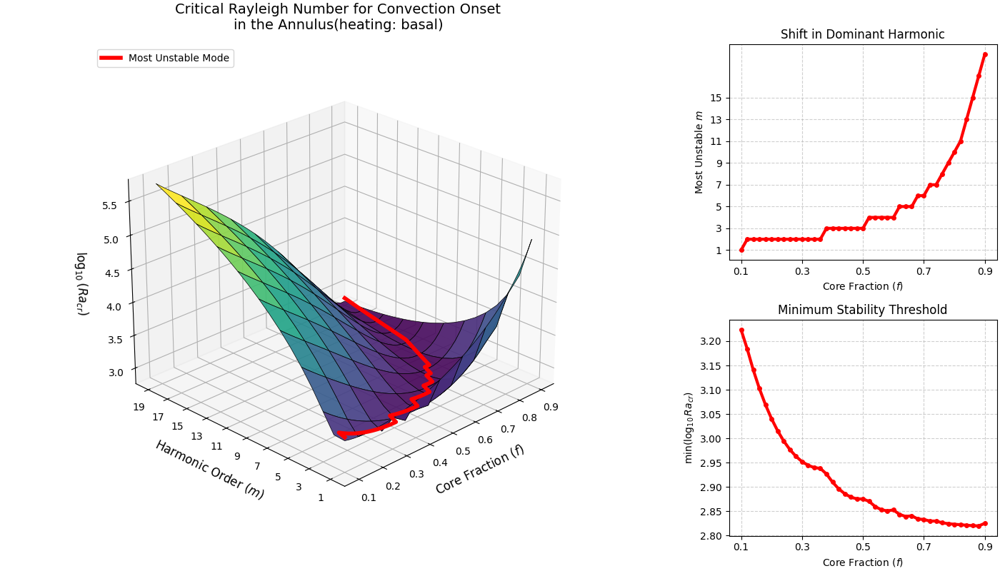
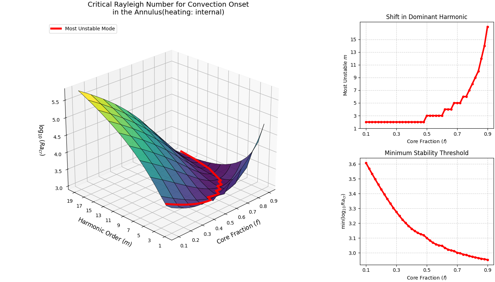

---
jupytext:
  text_representation:
    extension: .md
    format_name: myst
    format_version: 0.13
    jupytext_version: 1.19.0
kernelspec:
  display_name: Python 3 (ipykernel)
  language: python
  name: python3
---

```{code-cell} ipython3
from aliases import *
from referencing import search
```

```{code-cell} ipython3
search('van keken')
```

```{code-cell} ipython3
---
editable: true
slideshow:
  slide_type: ''
---
from aliases import *

import itertools

from criticality import *

from scipy.optimize import curve_fit
from sklearn.metrics import r2_score

from everest.window import Canvas, DataChannel as Channel, plot
from everest import window
from everest.caching import cache
from everest.window.colourmaps import cmap

from analysis import cylindrical

limit_memory(8.0)
```

```{code-cell} ipython3
cylindrical.r_mid(0.5)
```

```{code-cell} ipython3
def aspect_curvature_to_wavenumber(A, f):
    return cylindrical.r_mid(f) * np.pi / A

def wavenumber_to_aspect(m):
    return 2 * np.pi / m
```

```{code-cell} ipython3
convert_to_wavenumber(np.sqrt(2), 0.99999)
```

## Criticality as a function of geometry and heat

+++

NOTE TO SUPERVISOR: I'm writing up this section now. I have used my Everest/PlanetEngine software to generate over a hundred thousand models in complex converging series to identify to five or six decimal places exactly what the critical Rayleigh number is for varying geometry and heating scenarios. I expect this will be about five thousand words. I don't believe this work has been done before (certainly not in this way).

```{code-cell} ipython3
---
editable: true
slideshow:
  slide_type: ''
tags: [remove-cell]
---
!python3 linear_stability_annulus.py basal
```

+++ {"editable": true, "slideshow": {"slide_type": ""}, "tags": ["remove-cell"]}



*Results of a linear stability analysis, analogous to that performed before for Chandrasekhar's spherical shell harmonics, but for the annulus. Basally-heated thermal regime.*

```{code-cell} ipython3
---
editable: true
slideshow:
  slide_type: ''
---
!python3 linear_stability_annulus.py internal
```

+++ {"editable": true, "slideshow": {"slide_type": ""}, "tags": ["remove-cell"]}



*Results of a linear stability analysis, analogous to that performed before for Chandrasekhar's spherical shell harmonics, but for the annulus. Internally-heated thermal regime.*

+++

## Varying curvature

```{code-cell} ipython3
---
editable: true
slideshow:
  slide_type: ''
tags: [remove-cell]
---
# import pickle
# new_data = pickle.loads((storagepath / "simple_critical_2026_1__-_-_.data").read_bytes())
# old_data = pickle.loads((storagepath / 'simple_critical.data').read_bytes())
# (storagepath / 'simple_critical.data').write_bytes(pickle.dumps(old_data))

isomixed, isointernal, arrmixed, arrinternal = datas = make_frames(cache_refresh=True)
print(sum(map(len, datas)))
```

```{code-cell} ipython3
# Hs = np.linspace(0, 2, 11)
# aspects = np.linspace(1, 2, 11)
# fs = np.linspace(0.3, 0.5, 11)

# newdims = np.array(tuple(itertools.product(Hs, aspects, fs))).round(3)
# olddims = np.array(tuple(map(np.array, isomixed.index))).round(3)

# A, B = newdims, olddims
# void_type = np.dtype((np.void, A.dtype.itemsize * A.shape[1]))
# A_view = A.view(void_type).ravel()
# B_view = B.view(void_type).ravel()
# mask = ~np.isin(A_view, B_view)

# result = A[mask]
```

```{code-cell} ipython3
---
editable: true
slideshow:
  slide_type: ''
tags: [remove-cell]
---
slc = isomixed.loc[0, 1]

canvas = Canvas(size=(12, 4), shape=(1, 3))

def model(x, /, a, b, c, d):
    return a * (b / cylindrical.r_mid(x))**c + d
(*params,), error = curve_fit(model, slc.index, slc.values, (78, 1, 2, 785))
params = dict(zip('abcd', (map(float, params))))
synthetic = model(slc.index, **params)
natural = slc.values
linscore = r2_score(synthetic, natural)

synth_colour = 'tab:orange'

ax1 = canvas.make_ax((0, 0))

xchan = Channel(
    slc.index, label=r"$f$",
    lims=(None, 1.), capped=(None, True),
    )
ax1.scatter(
    xchan,
    Channel(
        natural, label=r"$\alpha$",
        ),
    )
ax1.line(
    xchan,
    Channel(
        synthetic,
        ),
    color=synth_colour,
    linestyle='--',
    )
ax1.annotate(
    xchan.data[5], synthetic[5],
    label = r"$ a {\left( 2b \frac{1-f}{f+1} \right)}^c + d $",
    points = (-30, -30),
    arrowprops = dict(arrowstyle = "->", color = synth_colour),
    )

ax2 = canvas.make_ax((0, 1))

ax2.scatter(
    Channel(synthetic, label=r"$\mathrm{synthetic}$"),
    Channel(natural, label=r"$\mathrm{empirical}$"),
    )

ax2.line(
    vals := np.linspace(np.min(synthetic), np.max(synthetic), 10), vals,
    color = synth_colour, linestyle = '--',
    )
ax2.annotate(
    *(map(np.median, (synthetic, natural))),
    label = f"${r'y=x, \\ R^2 =' + str(round(linscore, 10))}$",
    points = (15, -45),
    arrowprops = dict(arrowstyle = "->", color = synth_colour),
    )

ax3 = canvas.make_ax((0, 2))

ax3.scatter(
    xchan,
    Channel(
        synthetic / natural, label=r"$\mathrm{synthetic} / \mathrm{empirical}$",
        )
    )


display(canvas)
display(params)
```

```{code-cell} ipython3
theoretical = 779.3
print((slc.min() - theoretical) / theoretical * 100)
```

```{code-cell} ipython3
!pwd
```

```{code-cell} ipython3
isomixed.loc[0, 1.41:1.42]
```

## Varying aspect ratio

```{code-cell} ipython3
slc = isomixed.loc[0, :, 0.999]
# slc = arrmixed[0, :, 1., 0.999]

crit_func = lambda A: math.pi**4 * (1 + A**2)**3 / A**4
independent = slc.index
empirical = slc.values
theory = tuple(map(crit_func, slc.index))
discrepancy = empirical / theory

canvas = Canvas(size = (8, 6), shape = (2, 2))

synth_colour = 'tab:orange'

ax1 = canvas.ax((0, 0))
ax1.scatter(
    xchan := Channel(
        independent, label=r"$\mathrm{aspect}$",
        ),
    ychan := Channel(empirical, label=r"$\alpha$", log=False),
    )
ax1.line(
    xchan,
    Channel(theory, log=False),
    linestyle='--',
    color="tab:green"
    )
midpoint = round(len(theory) / 2)
ax1.annotate(
    xchan.data[midpoint], theory[midpoint],
    label = r"$\pi^4 \frac{{\left(1+A^2\right)}^3}{A^4}$",
    points = (0, 30),
    arrowprops = dict(arrowstyle = "->", color = "tab:green"),
    )

# ax1.props.edges.x.label.visible = False
# ax1.props.edges.x.ticks.major.labels = ()
# ax1.props.edges.x.swap()
# ax1.props.edges.x.ticks.major.labels[:] = []

def crit_aspect_correction_func(x, /, a, b, c, d):
    return a / (b*(x + c)) + d
(*params,), error = \
    curve_fit(crit_aspect_correction_func, slc.index, discrepancy)
crit_aspect_correction_params = dict(zip('abcd', (map(float, params))))
crit_aspect_correction = \
    lambda x: crit_aspect_correction_func(x, **crit_aspect_correction_params)

correction = crit_aspect_correction(slc.index)

ax2 = canvas.ax((0, 1))
ax2.scatter(
    xchan,
    Channel(discrepancy, label=r'$\mathrm{empirical} / \mathrm{theory}$'),
    )
ax2.line(
    xchan,
    Channel(correction),
    linestyle='--',
    color="tab:red",
    )
ax2.annotate(
    xchan.data[midpoint], correction[midpoint],
    # label = f"$ \\frac{{ {params['a']} }}{{ {params['b']} \\left( x + {params['c']} \\right) }} + {params['d']} $",
    label = r"$\frac{a}{b \left(A+c\right) + d}$",
    points = (20, 30),
    arrowprops = dict(arrowstyle = "->", color = "tab:red"),
    )

# ax2.props.edges.x.label.visible = False
# ax2.props.edges.x.ticks.major.labels = ()

crit_aspect_synthetic = lambda x: crit_func(x) * crit_aspect_correction(x)

synthetic = crit_aspect_synthetic(slc.index)

ax3 = canvas.ax((1, 0))
ax3.scatter(
    xchan,
    ychan,
    )
ax3.line(
    xchan,
    Channel(synthetic, log=False),
    linestyle='--',
    color=synth_colour,
    )
ax3.annotate(
    xchan.data[midpoint], synthetic[midpoint],
    label = r"$\mathrm{theory} \cdot \mathrm{correction}$",
    points = (0, 30),
    arrowprops = dict(arrowstyle = "->", color = synth_colour),
    )

ax4 = canvas.ax((1, 1))
ax4.scatter(
    Channel(synthetic, label=r"$\mathrm{synthetic}$"),
    Channel(empirical, label=r"$\mathrm{empirical}$"),
    )
linscore = r2_score(synthetic, empirical)
ax4.line(
    Channel(np.linspace(min(synthetic), max(synthetic), 100)),
    Channel(np.linspace(min(empirical), max(empirical), 100)),
    linestyle = '--',
    color=synth_colour,
    )
ax4.annotate(
    *map(window.utilities.median, (synthetic, empirical)),
    label = f"${'R^2 =' + str(round(linscore, 9))}$",
    points = (30, -30),
    arrowprops = dict(arrowstyle = "->", color = synth_colour),
    )

display(canvas)
display(params)
```

```{code-cell} ipython3
import matplotlib.pyplot as plt
import numpy as np
import pandas as pd
from matplotlib import cm
from scipy.interpolate import griddata

series = isomixed.loc[0]

# ==========================================
# 1. Extract and Clean Data via Interpolation
# ==========================================
f_raw = series.index.get_level_values("f").values
aspect_raw = series.index.get_level_values("aspect").values
alpha_raw = series.values

# Generate a uniform grid to eliminate patchiness
f_uniform = np.linspace(f_raw.min(), f_raw.max(), 100)
aspect_uniform = np.linspace(aspect_raw.min(), aspect_raw.max(), 100)
X, Y = np.meshgrid(f_uniform, aspect_uniform)

# Smooth interpolation (Cubic)
Z_alpha = griddata(
    points=(f_raw, aspect_raw), values=alpha_raw, xi=(X, Y), method="cubic"
)

# Edge patch for any stubborn NaNs at the borders
if np.isnan(Z_alpha).any():
    Z_edge_fix = griddata(
        points=(f_raw, aspect_raw), values=alpha_raw, xi=(X, Y), method="linear"
    )
    Z_alpha = np.where(np.isnan(Z_alpha), Z_edge_fix, Z_alpha)

# ==========================================
# 2. Track the Minimum Path (Most Unstable)
# ==========================================
# Find the index of the minimum alpha value along the aspect axis (axis=0) for each 'f'
min_idx = np.argmin(Z_alpha, axis=0)
min_aspect_val = aspect_uniform[min_idx]
min_alpha_val = Z_alpha[min_idx, np.arange(Z_alpha.shape[1])]

# ==========================================
# 3. Plotting the Entire Suite
# ==========================================
fig = plt.figure(figsize=(15, 7.5))

# ALIGNMENT FIX: Centered global title to prevent the 3D plot from clipping headers
fig.suptitle(
    "Critical Stability Surface",
    fontsize=14,
    fontweight="bold",
    y=0.96,
)

# --- Main 3D Surface Plot ---
ax1 = fig.add_subplot(121, projection="3d")
surf = ax1.plot_surface(
    X,
    Y,
    Z_alpha,
    cmap=cm.viridis_r,
    edgecolor="black",
    linewidth=0.1,  # Kept thin so the grid doesn't choke out the colors
    alpha=0.85,
)

# Highlighted minimum trajectory
ax1.plot(
    f_uniform,
    min_aspect_val,
    min_alpha_val,
    color="red",
    linewidth=4,
    label="Most Unstable Mode",
    zorder=10,
)

# ALIGNMENT FIX: Removed old local title to avoid overlapping text layouts
ax1.set_xlabel("Core Fraction ($f$)", fontsize=10)
ax1.set_ylabel("Aspect Ratio", fontsize=10)
ax1.set_zlabel(r"$\alpha$", fontsize=10)
ax1.view_init(elev=25, azim=-135)
ax1.legend(loc="upper left")

# --- Top Right: Shift in Dominant Harmonic (Aspect) ---
ax2 = fig.add_subplot(222)
ax2.plot(
    f_uniform,
    min_aspect_val,
    color="red",
    marker="o",
    markersize=2,
    linewidth=2,
)
ax2.set_title("Shift in Dominant Aspect", fontsize=11)
ax2.set_xlabel("Core Fraction ($f$)")
ax2.set_ylabel("Most Unstable Aspect")
ax2.grid(True, linestyle="--", alpha=0.5)

# --- Bottom Right: Minimum Stability Threshold ---
ax3 = fig.add_subplot(224)
ax3.plot(
    f_uniform,
    np.log10(min_alpha_val),
    color="red",
    marker="o",
    markersize=2,
    linewidth=2,
)
ax3.set_title("Minimum Stability Threshold", fontsize=11)
ax3.set_xlabel("Core Fraction ($f$)")
ax3.set_ylabel(r"min(log_{10} $\alpha$)")
ax3.grid(True, linestyle="--", alpha=0.5)

# ALIGNMENT FIX: Confines the layout engine to the bottom 90% of the window
plt.tight_layout()
plt.show()
```

```{code-cell} ipython3
10**2.82
```

## Varying both curvature and aspect ratio

```{code-cell} ipython3
slc = isomixed[0.]
display(slc)

canvas = Canvas(size=(12, 6), shape=(1, 2))

ax1 = canvas.make_ax()
fvals = tuple(sorted(
    val for val in set(slc.index.get_level_values('f'))
    if val >= 0.5
    ))
for fval in fvals:
    subslc = slc[:, fval].sort_index()
    ax1.line(
        subslc.index, subslc.values,
        color=cmap(fval, fvals, style = 'viridis'),
        )

ax2 = canvas.make_ax((0, 1))
for fval in fvals:
    # if fval != 0.5:
    #     continue
    subslc = slc[:, fval].sort_index()
    ax2.scatter(
        crit_aspect_synthetic(subslc.index), subslc.values,
        color=cmap(fval, fvals, style = 'viridis'),
        )

canvas
```

```{code-cell} ipython3
isomixed
```

```{code-cell} ipython3
isomixed.loc[0].groupby('f').min()
```

```{code-cell} ipython3
isomixed.loc[0].groupby('f').min().plot()
```

```{code-cell} ipython3
slc = isomixed[0.]
display(slc)

canvas = Canvas(size=(12, 6), shape=(1, 1))

ax1 = canvas.make_ax()
fvals = tuple(sorted(
    val for val in set(slc.index.get_level_values('f'))
    if val >= 0.5
    ))
for fval in fvals:
    subslc = slc[:, fval].sort_index()
    ax1.line(
        subslc.index, subslc.values,
        color=cmap(fval, fvals, style = 'viridis'),
        )

canvas
```

```{code-cell} ipython3
slc = isomixed[0, :, 0.5]
display(slc)

canvas = Canvas(size=(12, 12))
ax = canvas.make_ax()
ax.scatter(
    chanx := Channel(crit_aspect_synthetic(slc.index)),
    chany := Channel(slc.values),
    c=slc.index,
    )
for x, y, z in zip(chanx.data, chany.data, slc.index):
    ax.annotate(x, y, round(z, 2))
canvas
```

```{code-cell} ipython3
arrmixed
```

```{code-cell} ipython3
(11 * 11 * 10 * 21)**0.5
```

```{code-cell} ipython3
5 * 5 * 5 * 10
```

```{code-cell} ipython3
np.log10(np.unique(arrmixed.reset_index()['etaDelta']))
```

```{code-cell} ipython3
np.arange(0.3, 1., 0.05)[1::2]
```

```{code-cell} ipython3
arrmixed
```

```{code-cell} ipython3
np.arange(0.3, 1., 0.05)[1::2]
```

```{code-cell} ipython3
np.unique(arrmixed.loc[0].reset_index()['etaDelta'])
```

```{code-cell} ipython3
arrmixed.reset_index()[['aspect', 'H', 'etaDelta']].plot()
```

```{code-cell} ipython3
canvas = Canvas(size=(12, 12))
ax1 = canvas.make_ax()
ax1.scatter(
    Channel(arrmixed.reset_index()['f']),
    Channel(np.log10(arrmixed.reset_index()['etaDelta'])),
    # Channel(arrmixed.reset_index()['H']),
    20,
    Channel(arrmixed),
    )

canvas
```
